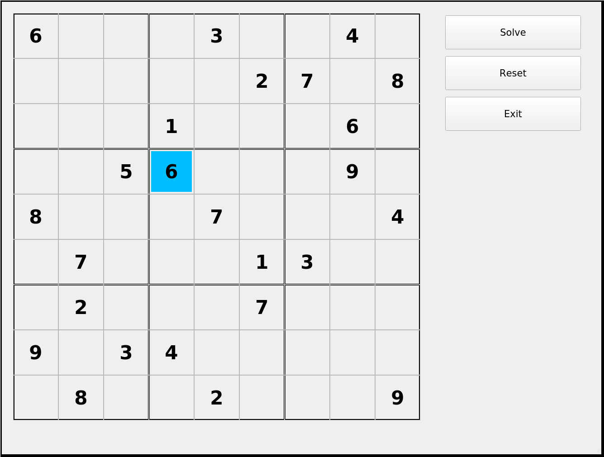

# Simple Sudoku Solver

This is a simple sudoku solver that reads in a sudoku grid from a file (format
example below) and then can brute force a solution. It is very simple right now
and more features may be added in the future.

## Input file example: grid.txt

```
6 0 0  0 3 0  0 4 0
0 0 0  0 0 2  7 0 8
0 0 0  1 0 0  0 6 0

0 0 5  6 0 0  0 9 0
8 0 0  0 7 0  0 0 4
0 7 0  0 0 1  3 0 0

0 2 0  0 0 7  0 0 0
9 0 3  4 0 0  0 0 0
0 8 0  0 2 0  0 0 9
```

## Running

```
$ ./sudoku grid.txt
```

### Before


### Solved


